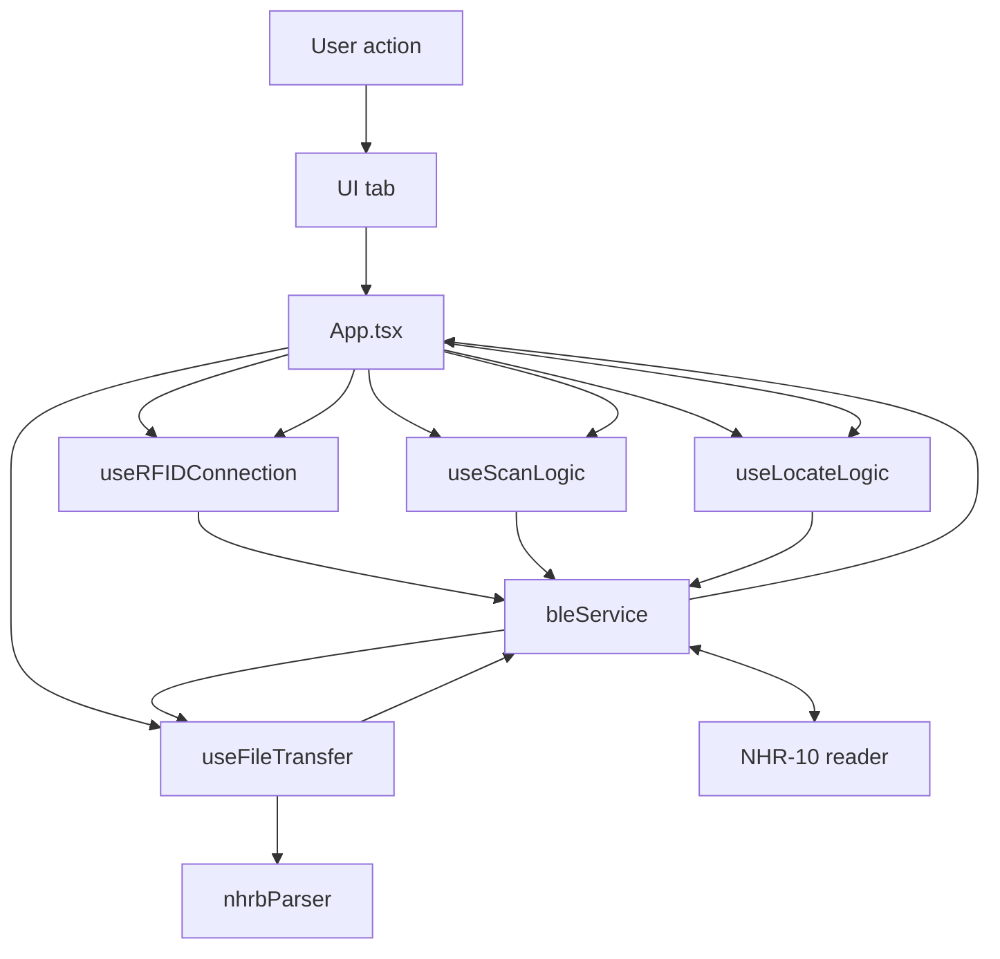

# Nextwaves NHR-10 RFID Bluetooth Integration Manual

I’m sharing this guide to help developers understand how to operate the current web app and integrate its RFID Bluetooth control logic into other apps or platforms.

The goal is to make the repository easy to reuse: keep the stable device-control flow, separate it from the current UI, and rebuild it safely for web, mobile, desktop, or native BLE applications.

## 1. System Scope

The current web app handles 6 main functional areas:

| Area | Purpose | Main modules |
|---|---|---|
| Device connection | Scan BLE, connect GATT, discover services/characteristics, handle disconnect | `services/bleService.ts`, `hooks/useRFIDConnection.ts` |
| Realtime tag reading | Start/stop inventory, receive `live_tags`, calculate count/RSSI/statistics | `hooks/useScanLogic.ts` |
| Batch inventory | Start/stop batch mode, wait for device-side saving, fetch EPC history | `hooks/useScanLogic.ts`, `hooks/useFileTransfer.ts` |
| Tag locating | Locate one target EPC using RSSI feedback | `hooks/useLocateLogic.ts` |
| Tag writing | Write EPC or another memory bank | `App.tsx`, `services/bleService.ts` |
| Reader configuration | Power, RF link profile, Q/session, query timing, Tag Focus, save config | `App.tsx`, `components/dashboard/SettingsTab.tsx` |

The current UI is in `components/`. Device-control logic is mainly in `services/`, `hooks/`, `utils/`, and `types.ts`.

## 2. Running The Current Web App

Requirements:

- Node.js LTS.
- A browser that supports Web Bluetooth.
- `localhost` during development, or HTTPS in production.
- The user must press the Connect button directly. Web Bluetooth requires a user gesture before opening the device picker.

```bash
npm install
npm run dev
```

Build:

```bash
npm run build
npm run preview
```

TypeScript check:

```bash
npm run lint
```

## Demo controller interface

The controller opens on **Scan tags**, with a three-step connection and inventory guide. Main navigation contains **Scan tags**, **Find a tag**, **Write EPC**, and **Saved data**. **Advanced** contains **Device settings** and **Diagnostics**; the Develop/camera tab has been removed.

- **Scan tags:** Start scan shows live EPCs. Scan to device records a batch on the reader. Scan options holds RF presets and the stale-tag timeout, entered directly in milliseconds. Find tag carries an EPC into the locating view. Excluded tags can be restored.
- **Find a tag:** Select a scanned EPC or enter it manually. Positive firmware signal values are labelled reader units; negative RSSI values are labelled dBm. The signal bar is relative, not a distance estimate.
- **Write EPC:** Validate hexadecimal words, review the selected data, and confirm before writing. Advanced memory writing stays collapsed until needed. A missing write acknowledgement times out after 10 seconds and asks the operator to verify the tag before retrying.
- **Saved data:** Stop and save the batch, then retrieve its EPC list. CSV, TXT, JSON, and sharing are available after download. Clear preview only clears the browser data.
- **Device settings:** Read retrieves the current device value; Apply sends an update. Save configuration persists applied settings. RF edits and conflicting operations are disabled while the device is busy.
- **Diagnostics:** Inspect identity, firmware, voltage, charger and temperature; filter or search TX/RX/error events; test the reader display/buzzer. Export service report downloads device state, environment details, operation state, and up to 1,000 retained log entries as JSON.

Browser notices expire after **4.2 seconds** (normal) or **6.5 seconds** (errors). Notification timers are independent of incoming BLE traffic. Identical repeated events are suppressed for 10 seconds, and notices can be dismissed manually. Full events remain in Diagnostics.

Verification:

```bash
npm run lint
npm test
npm run build
```

Automated tests cover notification lifetime during streaming telemetry, navigation, busy-state guards, EPC confirmation, diagnostic filtering, and operation coordination. Actual RF performance, BLE reconnect, tag writes, and firmware batch save should also be checked with an NHR-10 reader.

For browser UI checks, run the development server and open `/tests/ui.html`. This explicitly labelled fixture provides 240 simulated tags and continuous RX logs without connecting to hardware. It is not included in the production build.

## 3. Current App Operation Manual

### 3.1 Connecting The Reader

1. Open the web app.
2. Press `Connect`.
3. The browser opens the Bluetooth device picker.
4. Select the device by its configured advertising name. A factory/default unit uses `NHR10-XXXXXX`; legacy `NHR-10` and `Nextwaves` names remain supported during migration.
5. The app connects to GATT, gets service `FF`, discovers characteristics `FF01`, `FF02`, and `FF03`, and starts notifications on `FF01`.
6. The web client issues `DI` over `FF01` and verifies its Canonical ID (`NHR10-` plus 12 hexadecimal MAC digits). For a default `NHR10-XXXXXX` name it also verifies the six-digit suffix; a configured free-form name remains separate from identity. It does not read Device Information Serial Number `0x2A25`, which Web Bluetooth blocklists for privacy.
7. Only after identity verification succeeds does the app mark the transport ready and read the initial reader state: configured Bluetooth name, firmware, battery, power, link profile, Q/session, query params, Tag Focus, region, and temperature.

After connection, the app starts a heartbeat loop to verify that the device is still online. If the GATT link drops unexpectedly, the app invalidates the old GATT characteristics and makes five bounded reconnect attempts (0.5 s, 1 s, 2 s, 4 s, and 8 s delays) against the same browser-authorized device. Every successful reconnect rediscovers services/characteristics, re-enables notifications, revalidates identity through `DI`, and resynchronizes reader state. A user-requested disconnect never triggers automatic reconnect.

### 3.2 Scan Tags

The Scanner tab is used for realtime inventory and batch mode.

Interactive scan:

1. Press `Start scan`.
2. The app clears the previous tag list.
3. The app sends `{ "cmd": "S" }` through `FF01`.
4. The reader starts inventory.
5. The reader sends `live_tags` notifications through `FF01`.
6. The app merges tags by EPC and updates count, RSSI, first seen, and last seen.
7. The UI renders the tag list with throttling to stay smooth at high tag rates.
8. Press `Stop scan`; the app sends `{ "cmd": "X" }` in a short repeated burst to improve reliability in noisy BLE environments.

Batch mode:

1. Press `Scan to device`.
2. The app sends `{ "cmd": "SB" }`.
3. The reader performs inventory and stores data internally.
4. Press `Stop & save batch`; the app sends `{ "cmd": "XB" }`.
5. If the reader returns `saving` or `busy`, the app waits until device-side saving is complete.
6. Batch data is downloaded from the Storage tab using the `FF02`/`FF03` file-transfer flow.

Scanner presets:

| Preset | Meaning |
|---|---|
| `STANDARD` | Balanced inventory scanning for normal or dense tag populations |
| `QUICK` | Faster scanning for fewer tags or quick tracking |
| `DEEP` | Prioritizes read range for longer-distance tag search |

Presets currently send baseband configuration and Tag Focus commands over BLE.

### 3.3 Locate Tab

Locate mode is used to find one specific EPC:

1. Enter the target EPC.
2. Start locate mode.
3. The app sends `{ "cmd": "F", "val": "<EPC>" }`.
4. The reader returns `{ "cmd": "F", "epc": "...", "rssi": -xx }`.
5. The app displays RSSI as locate signal strength.
6. When stopped, the app sends `{ "cmd": "X" }`.

Locate should not run at the same time as Interactive Scan or Batch Mode. The current app uses a single operation mode to avoid mixing data between workflows.

### 3.4 Encode Tab

The Encode tab writes tag data:

- Quick EPC write sends command `WE`.
- Advanced memory write sends command `WD`.

General flow:

1. Enter the target EPC and/or the new data.
2. Enter an access password if required by the tag. Default password is `00000000`.
3. The app sends the write command through `FF01`.
4. The reader returns a `WE` or `WD` response.
5. If `status = ok`, the app reports success. If a `code` or error state is returned, the app reports failure.

When integrating into another platform, validate hex strings before sending. For EPC memory bank writes, data length should be a multiple of 4 hex characters to match word boundaries.

### 3.5 Storage Tab

The Storage tab downloads batch data stored in the reader:

1. Press fetch history.
2. The app starts notifications on `FF03`.
3. The app writes the string `send_file` to `FF02`.
4. The reader sends START, DATA, and EOF frames through `FF03`.
5. The app reassembles chunks by sequence number.
6. The app verifies chunk count and file size.
7. The app parses the NHRB file with `utils/nhrbParser.ts`.
8. The app displays the EPC list and supports JSON/CSV/TXT export and file sharing.

If the reader is still saving batch data, the app receives a busy response and retries up to 8 times, with a 1200 ms delay between attempts.

### 3.6 Advanced Device Settings

The Settings tab reads and writes reader configuration:

| Setting | Read command | Set command | Notes |
|---|---|---|---|
| Bluetooth device name | `GDN` | `SDN` | Persistent GAP/advertising name, 1–14 UTF-8 bytes |
| RF output power | `GP` | `SP` | dBm value |
| RF link profile | `GLP` | `SLP` | Example profiles: 11/13/53 |
| Q/session | `GQS` | `SQS` | EPC Gen2 singulation parameters |
| Query timing | `GQP` | `SQP` | interval, dwell, append |
| Tag Focus | `GTF` | `TF`, `STF` | `TF` sets runtime value, `STF` saves it |
| Device popup (Diagnostics) | - | `POPUP` | Tests display on the reader |
| Save config | - | `SAVE` | Saves configuration to flash |

## 4. Code Architecture

```text
.
├── App.tsx
├── services/
│   └── bleService.ts
├── hooks/
│   ├── useRFIDConnection.ts
│   ├── useScanLogic.ts
│   ├── useLocateLogic.ts
│   └── useFileTransfer.ts
├── utils/
│   ├── battery.ts
│   └── nhrbParser.ts
├── components/
│   └── dashboard/
└── types.ts
```

Module roles:

- `services/bleService.ts`: BLE transport/protocol layer. It owns UUIDs, characteristics, connection flow, command sending, and notification parsing.
- `hooks/useRFIDConnection.ts`: connected/disconnected state, settings, battery snapshots, telemetry.
- `hooks/useScanLogic.ts`: interactive scan, batch scan, live tag map, statistics, stop burst.
- `hooks/useLocateLogic.ts`: locate state and RSSI response handling.
- `hooks/useFileTransfer.ts`: file request, transfer progress, busy retry, NHRB parsing.
- `utils/battery.ts`: validates `GB` telemetry and derives the shared relative battery gauge.
- `utils/nhrbParser.ts`: batch file parser, independent from React.
- `App.tsx`: connects `bleService` callbacks to hooks and protects operation mode routing.
- `components/`: current UI. This can be replaced completely in another app.

## 5. BLE Service And Characteristics

The device uses a custom BLE service:

| Component | UUID | Role |
|---|---|---|
| Service | `000000ff-0000-1000-8000-00805f9b34fb` | Main service |
| `FF01` | `0000ff01-0000-1000-8000-00805f9b34fb` | Send JSON commands, receive responses and live tag notifications |
| `FF02` | `0000ff02-0000-1000-8000-00805f9b34fb` | Request batch file by writing `send_file` |
| `FF03` | `0000ff03-0000-1000-8000-00805f9b34fb` | Receive batch file notifications |

Device selector:

- Prefer the advertised custom service UUID and the new `namePrefix: "NHR10-"`; retain `NHR-10` and `Nextwaves` filters only for migration.
- Always pass the custom service in `optionalServices` for the `acceptAllDevices` fallback. Do not request or read the blocklisted Device Information Serial Number `0x2A25` from a Web Bluetooth client.
- If a runtime cannot parse the filters, fallback to `acceptAllDevices: true`, but still pass `optionalServices`.
- Never use `BluetoothDevice.id`, an Android BLE address, or an iOS peripheral UUID as the business identity. Use the verified Canonical ID.

### Device-initiated unpair

When `FF01` sends `{"cmd":"UQ","v":1}`, the transport treats it as an intentional unpair rather than link loss. It synchronously disables reconnect, cancels the reconnect delay and queued commands, clears persisted device/auto-connect keys, and immediately writes `{"cmd":"UA","v":1}` to `FF01` with response. The app does not close GATT before this ACK and waits for the peripheral to disconnect.

After that disconnect, the selected device reference is released and no reconnect is scheduled. A new connection is possible only through the user-initiated Bluetooth picker. Other JSON packets and binary `live_tags` packets on `FF01` keep their existing handling.

## 6. Operation State Machine

The app should always have one active operation mode:

```ts
type InventoryMode = 'idle' | 'interactive' | 'batch' | 'batchSaving' | 'locate';
```

Meaning:

| Mode | Reader activity | App accepts |
|---|---|---|
| `idle` | No inventory | Settings, battery, temperature |
| `interactive` | Realtime scan | `live_tags`, battery snapshots |
| `batch` | Device-side batch inventory | Status, slower battery polling |
| `batchSaving` | Reader is saving batch data | Avoid dense polling, wait for save completion |
| `locate` | Target EPC search | `F` response with RSSI |

Important rules:

- Stop or suspend the old mode before starting a new one.
- Do not process `live_tags` unless mode is `interactive`.
- Do not process `F` responses unless mode is `locate`.
- On disconnect, reset scan state, locate state, and batch saving state.
- Do not fetch history while batch saving is active.

## 7. Data Flow



`bleService.setCallbacks()` is the key integration point:

```ts
bleService.setCallbacks(
  handleDataReceived,
  addLog,
  handleFileCallback
);
```

`handleDataReceived` in `App.tsx` routes data:

- Settings/system responses always go to connection logic.
- `live_tags` only goes to scan logic while scanning is active.
- `F` responses only go to locate logic while locate is active.
- `WE`/`WD` responses update write status.
- `SAVE`/`XB` batch save responses update saving state.

## 8. Command Protocol

All main control commands are sent through `FF01` as UTF-8 JSON:

```ts
await bleService.sendCommand({ cmd: 'S' });
```

`sendCommand()` protects BLE GATT with two mechanisms:

- Command queue: only one command write runs at a time.
- Write gap: command writes are spaced by about 85 ms.

Keep both mechanisms when porting to another platform. In real BLE operation, writing too quickly can cause GATT errors, dropped commands, or firmware-side processing overload.

Main commands:

| Command | Purpose |
|---|---|
| `DI` | Read immutable device identity and firmware info |
| `GDN` / `SDN` | Get/set the persistent GAP and advertising device name |
| `GRI` | Read firmware/info |
| `GB` | Read battery |
| `GT` | Read temperature |
| `GP` / `SP` | Get/set RF power |
| `GLP` / `SLP` | Get/set link profile |
| `GQS` / `SQS` | Get/set Q and session |
| `GQP` / `SQP` | Get/set query timing |
| `GTF` / `TF` / `STF` | Get/set/save Tag Focus |
| `S` / `X` | Start/stop interactive scan |
| `SB` / `XB` | Start/stop batch scan |
| `F` | Locate EPC |
| `WE` | Write EPC |
| `WD` | Write memory bank |
| `POPUP` | Show popup on reader |
| `SAVE` | Save configuration |

### 8.1 Bluetooth device name

The Settings tab reads the configured name with `{"cmd":"GDN"}` and writes it
with `{"cmd":"SDN","val":"HANDHELD KHO A"}`. The client accepts exactly
1–14 UTF-8 bytes (excluding the firmware's trailing NUL), rejects malformed
Unicode and C0/C1 control characters, and uses `JSON.stringify` so quotes and
backslashes are escaped correctly.

After an `SDN` acknowledgement, the client issues `GDN` again and treats that
response as authoritative. Firmware is responsible for committing the value to
NVS, applying it to both the GAP Device Name and advertising payload, and
publishing it when advertising restarts after disconnect. `SDN` never changes
the `DI` Canonical ID/MAC. Device discovery continues to work with arbitrary
configured names because the primary picker filter uses the custom service UUID.

## 9. Notification Protocol

### 9.1 JSON Response

If an `FF01` notification starts with byte `{` (`0x7B`), the app decodes it as UTF-8 and parses JSON.

Example:

```json
{"cmd":"GB","voltage":7920,"state":"NORMAL","load":"idle","chg":"fast CC","vbus":9008,"ibat":846,"pd_v":9000,"pd_i":2000,"fault":0}
```

The app keeps `voltage` as integer pack millivolts and normalizes the protection
state only for internal comparison. Charger fields are optional because the
firmware can send either the extended response, the compact response, or
`"chg":"unknown"` when fresh charger telemetry is unavailable.

The displayed percentage is a relative five-zone gauge, not measured state of
charge. `utils/battery.ts` interpolates 20% within each adjacent pair of bounds:

```text
6000, 7000, 7400, 7700, 8000, 8400 mV
  0%,  20%,  40%,  60%,  80%, 100%
```

The client polls `GB` no faster than once every five seconds because firmware
refreshes its slow UI/BLE battery value on that cadence. A mode transition uses
the next eligible poll. Any unsolicited `GB`, including warning and shutdown
notifications, replaces the current snapshot. On disconnect or battery timeout,
the last snapshot is retained with `stale: true`; it is never replaced with 0 V
or 0%.

Web Bluetooth does not expose an API for explicitly requesting ATT MTU 185. The
browser and operating system negotiate the MTU; deployments must verify that the
resulting notification payload can carry at least the firmware's compact `GB`
response.

### 9.2 Binary live_tags

If a notification starts with `NH`, the app parses a binary live tag frame:

```text
byte 0..1  : "NH"
byte 2     : version = 1
byte 3     : type = 1
byte 4..7  : seq uint32 little-endian
byte 8     : itemCount
items      : epcLen + epcBytes + rssi int8 + countDelta uint16 LE + totalCount uint32 LE
```

After parsing, the app normalizes it to the same logical payload:

```ts
{
  cmd: 'live_tags',
  seq: number,
  d: [
    [epcHex, rssi, countDelta, totalCount]
  ]
}
```

`bleService` batches multiple live tag frames and flushes every 100 ms so the UI remains smooth at high tag rates.

## 10. Batch File NHRB

The batch file is downloaded through `FF03` after the app writes `send_file` to `FF02`.

Frames on `FF03`:

| Header | Meaning |
|---|---|
| `0xFFFF` | START frame, payload is JSON metadata |
| sequence number | DATA frame |
| `0xFFFE` | EOF frame |
| Unframed JSON | Busy/error response |

START metadata:

```json
{
  "cmd": "START",
  "format": "NHRB",
  "version": 1,
  "size": 1234,
  "chunks": 10
}
```

NHRB file format:

| Offset | Field |
|---|---|
| 0..3 | Magic `NHRB` |
| 4 | Version `1` |
| 5 | Header length `32` |
| 6 | Format ID `1` |
| 7 | Record size `17` |
| 8..11 | Record count, uint32 LE |
| 12..15 | Payload bytes, uint32 LE |
| 16..19 | Payload CRC32, uint32 LE |
| 20..23 | Unix timestamp, uint32 LE |
| 24 | Max EPC length, currently `16` bytes |

Each record:

```text
byte 0      : epcLen
byte 1..16  : EPC bytes
```

The parser must verify magic, version, size, and CRC32 before exposing EPC data to the app.

## 11. Integrating Into Another Platform

When porting to another platform, separate the system into 3 layers:

| Layer | Responsibility | Reuse strategy |
|---|---|---|
| UI/Application | Screens, buttons, tables, navigation, forms | Replace for the new app |
| RFID controller | State machine, scan/locate/batch/write flow, callback routing | Reuse `hooks/` or rebuild the same logic |
| BLE transport | Connect, discover service, write command, subscribe notifications | Web uses `bleService`; native platforms need an equivalent adapter |

Minimum interface to keep across platforms:

```ts
interface RFIDTransport {
  connect(): Promise<void>;
  disconnect(): void;
  sendCommand(command: object): Promise<void>;
  requestFileTransfer(): Promise<void>;
  onDataReceived(callback: (data: unknown) => void): void;
  onFileTransfer(callback: (event: string, data?: unknown) => void): void;
  onLog(callback: (message: string, type: 'info' | 'error' | 'rx' | 'tx') => void): void;
}
```

Recommended porting flow:

1. Keep the command set and UUIDs unchanged.
2. Implement a BLE transport for the target platform.
3. Port the `idle/interactive/batch/batchSaving/locate` state machine.
4. Port JSON parsing, binary `live_tags` parsing, and NHRB parsing.
5. Port heartbeat logic according to the platform’s BLE behavior.
6. Build a new UI that calls these actions: connect, start scan, stop scan, start batch, stop batch, fetch history, locate, write, settings.
7. Test each flow independently before combining them into the full UI.

## 12. Platform Guidance

| Platform | Recommended integration approach |
|---|---|
| Desktop web | Use Web Bluetooth directly if the browser supports it, served via HTTPS/localhost |
| Android web | Use Web Bluetooth on a supported browser; connect still needs a user gesture |
| Android WebView | Check `navigator.bluetooth`; if unavailable or unstable, use a native BLE bridge |
| Native Android | Implement BLE with Android Bluetooth APIs; keep the same JSON commands and parsers |
| iOS/iPadOS | Use native CoreBluetooth or a native bridge for WebView; do not depend on PWA Web Bluetooth directly |
| Windows native | Implement BLE with WinRT/Bluetooth APIs or a desktop framework BLE plugin |
| macOS native | Implement BLE with CoreBluetooth or a desktop framework BLE plugin |
| Desktop wrapper | Use web transport if the embedded Chromium runtime supports Web Bluetooth reliably; otherwise use a native bridge |

The key point: the new app does not have to use Web Bluetooth. As long as it keeps the protocol, UUIDs, command queue, state machine, and data parsers, it can reproduce the same behavior over native BLE.

## 13. Integration Checklist

- If using Web Bluetooth, connect must be triggered by a user action.
- Always include the custom service UUID in `optionalServices`; verify web identities through `DI` instead of the blocklisted `0x2A25` characteristic.
- Validate the Canonical ID after connecting and after every automatic reconnect.
- Do not send parallel commands on the same characteristic.
- Keep a small delay between command writes.
- Do not run `interactive`, `batch`, and `locate` at the same time.
- Suspend live tags when stopping scan, starting batch, locating, or disconnecting.
- When stopping scan/batch, wait for response or use stop retry like the current web app.
- Do not fetch batch files while the reader is still `saving` or `busy`.
- When receiving batch files, verify chunks, size, and CRC.
- Log TX/RX during bring-up to compare app behavior with firmware behavior.
- For native bridges, expose an API shaped like `bleService` so upper-level app logic stays platform-independent.

## 14. Notes When Reusing This Source Code

- `bleService` is currently a singleton. If the new app must connect to multiple readers at the same time, refactor it into multiple instances.
- `App.tsx` protects operation mode and routes callback data. Do not copy `useScanLogic` alone while dropping the callback guard.
- `SettingsTab` currently has some buttons that call `bleService` directly. In a new app, settings commands can be moved into a dedicated controller for easier maintenance.
- `utils/nhrbParser.ts` is independent and should be kept nearly unchanged when porting.
- BLE logic is optimized for one NHR-10/Nextwaves reader. If firmware changes commands or binary frames, update `bleService` first, then update UI logic.

## 15. Platform References

- [MDN: Web Bluetooth API](https://developer.mozilla.org/en-US/docs/Web/API/Web_Bluetooth_API)
- [Chrome Developers: Communicating with Bluetooth devices over JavaScript](https://developer.chrome.com/docs/capabilities/bluetooth)
- [Google Chrome Help: Connect a website to a Bluetooth device](https://support.google.com/chrome/answer/6362090)
- [WebKit Bug 238049: Add Support for Web Bluetooth in iOS WebKit](https://bugs.webkit.org/show_bug.cgi?id=238049)

## Controller feedback and targeted writes

Device settings now wait for device replies and verify Apply by reading the value back. See [the inspected firmware contract and missing Region/Save handlers](docs/settings-firmware-contract.md) before relying on those features.

- Device activity occupies a fixed-height row. Pending commands disable conflicting controls without inserting inline notices or moving the page contents.
- Find mode treats `F` with `rssi: -100` as the NHR-10 lost-target sentinel, not a measured signal. The available NHR-10 REVC firmware sends this after 2 seconds without a target read. A 2.5-second browser watchdog also clears a stale reading if that notification is missed. Waiting, detected, lost and stopped states remain separate; late packets for another EPC or a stopped session are ignored.
- Write results appear in the shared dismissible notification: 4.2 seconds for a confirmation, 6.5 seconds for an error. Each write attempt has its own notification identity. Transport errors, a disconnect and a 10-second response timeout also produce a notice. All results remain in Diagnostics / the exported service report after the toast disappears.
- Advanced memory write uses a single Target EPC input. When Scan tags has results, its arrow opens those EPCs directly; typing filters the list, and selecting an EPC closes it. With no scan results, the input remains available for manual entry without a dropdown. Selection fills the actual `epc` field sent with `WE` or `WD`; it does not alter the stored scan results. Those results are previous observations and are not a fresh presence check. Scan again after writing to verify the new data.
- Quick EPC write sends an empty target EPC. The available firmware forwards this to the RFID module with a zero-length EPC selector; there is no firmware-side count check proving that exactly one physical tag is present. Do not assume that multiple tags must yield a failure. Isolate one tag for quick write, or select its EPC in Advanced memory write. Tags sharing an EPC still cannot be distinguished by an EPC-only selector.

Validation: `npm run lint`, `npm test`, and `npm run build`. The development-only `/tests/ui.html` fixture provides command-wait, tag-lost and write-failure controls with simulated tags and continuous RX logs. It never connects to a reader and is not a production build entry point. Hardware write outcomes still require validation on the device and its installed firmware.
